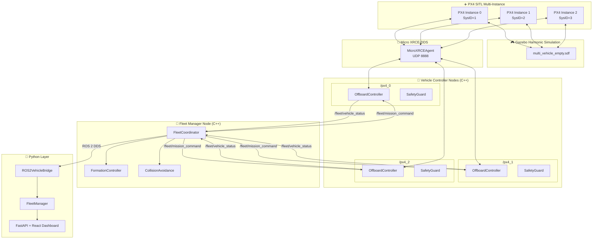
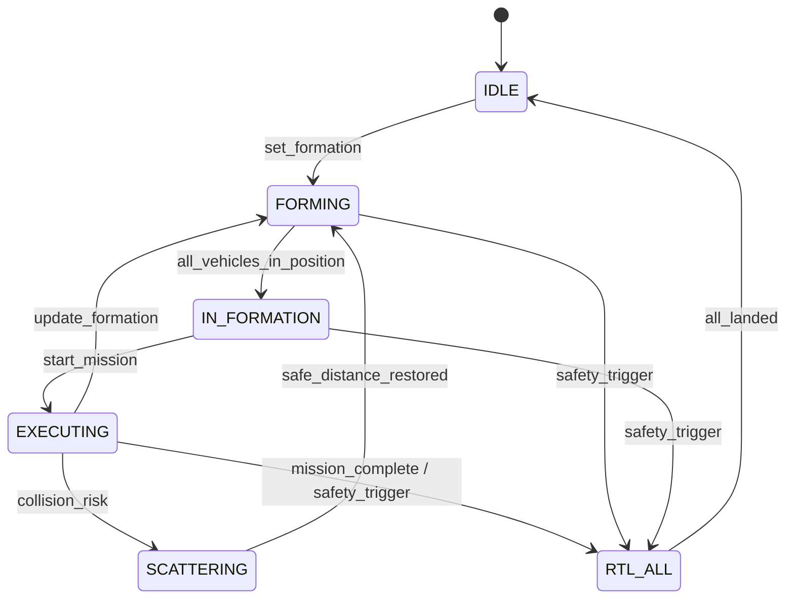
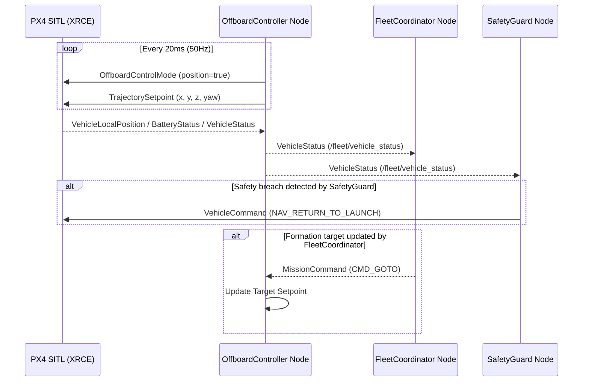

# Architecture — Multi-UAV Autonomous Inspection Platform

## System Overview

The **Multi-UAV Inspector** is a enterprise multi-vehicle simulation foundation built on **PX4 SITL**, **ROS 2 Jazzy (C++)**, **Micro XRCE-DDS**, and **Gazebo Harmonic**. It provides a scalable architecture for multi-vehicle inspection missions, offboard control, formation flight, and reactive inter-vehicle collision avoidance.

The codebase is built on **SOLID principles**, **OOP best practices**, and **GoF design patterns** to achieve modularity between the low-level C++ vehicle controllers, the fleet manager, and the Python-side perception and dashboard stack.

---

## Design Principles Applied

### SOLID Principles

| Principle | Implementation |
|:---|:---|
| **SRP** | C++ `OffboardController` manages single-vehicle state & 50Hz setpoints; `SafetyGuard` enforces safety rules; `FleetCoordinator` owns fleet state machine; `FormationController` computes geometry. |
| **OCP** | Formation patterns use Strategy pattern (`FormationController::compute_targets`) — adding a new formation requires only a pattern handler. Safety rules use Chain of Responsibility (`SafetyGuard::safety_check_loop`). |
| **LSP** | `ROS2VehicleBridge` and `MAVLinkBridge` both implement the `DroneConnector` interface and are drop-in substitutable. |
| **ISP** | Focused C++ and Python interfaces: `OffboardControllerInterface` for setpoint stream, `MultiVehicleConnector` for fleet connections. |
| **DIP** | Python high-level mission manager depends on `DroneConnector` and `FlightController` ABCs, allowing transparent execution over ROS 2 DDS or MAVSDK. |

### Design Patterns

| Pattern | Where | Purpose |
|:---|:---|:---|
| **Strategy** | `FormationController` (`line`, `v_formation`, `circle`, `diamond`) | Pluggable formation geometries computed relative to fleet leader |
| **Observer** | ROS 2 pub/sub + Python `EventBus` | Decoupled telemetry (`/fleet/vehicle_status`), commands (`/fleet/mission_command`), and events |
| **Chain of Responsibility** | `SafetyGuard` in C++ / `SafetyMonitor` in Python | Cascading safety checks (battery, geofence, altitude, separation) |
| **Factory** | ROS 2 `full_system.launch.py` / Python `AppFactory` | Config-driven dynamic vehicle node generation |
| **State Machine** | `FleetCoordinator` (C++) & `MissionStateMachine` (Python) | Multi-vehicle fleet state transitions: `IDLE → FORMING → IN_FORMATION → EXECUTING → RTL_ALL` |
| **Potential Field** | `CollisionAvoidance` | Reactive velocity obstacles with priority-based right-of-way resolution |

---

## System Component Topology



---

## ROS 2 Workspace Structure (`ros2_ws/`)

```
ros2_ws/src/
├── multi_drone_msgs/                    # ROS 2 Interfaces Package
│   ├── msg/
│   │   ├── VehicleStatus.msg            # Per-vehicle telemetry & status
│   │   ├── FleetStatus.msg              # Aggregated fleet telemetry & state
│   │   ├── FormationCommand.msg          # Formation change requests
│   │   └── MissionCommand.msg            # High-level control commands
│   └── srv/
│       ├── RegisterVehicle.srv          # Vehicle registration service
│       └── AssignMission.srv            # Per-vehicle mission assignment
│
├── vehicle_controller/                  # Per-Vehicle C++ Control Package
│   ├── include/vehicle_controller/
│   │   ├── offboard_controller.hpp      # 50Hz setpoint publisher & PX4 cmd bridge
│   │   ├── safety_guard.hpp             # Configurable geofence & separation guard
│   │   └── telemetry_monitor.hpp        # Standalone telemetry monitor
│   ├── src/
│   │   ├── offboard_controller.cpp
│   │   ├── safety_guard.cpp
│   │   └── telemetry_monitor.cpp
│   └── launch/
│       └── vehicle.launch.py            # Single vehicle launch
│
├── fleet_manager/                       # Fleet Coordination C++ Package
│   ├── include/fleet_manager/
│   │   ├── fleet_coordinator.hpp        # Central state machine & command dispatcher
│   │   ├── formation_controller.hpp     # Geometry generator (Line, V, Circle, Diamond)
│   │   └── collision_avoidance.hpp      # Potential field collision avoidance
│   ├── src/
│   │   ├── fleet_coordinator.cpp
│   │   ├── formation_controller.cpp
│   │   └── collision_avoidance.cpp
│   └── launch/
│       └── fleet.launch.py              # Fleet coordinator launch
│
└── multi_drone_bringup/                 # System Launch Package
    └── launch/
        └── full_system.launch.py        # System bringup (N vehicles + coordinator)
```

---

## Multi-Vehicle Fleet State Machine



---

## Offboard Control Loop (50 Hz)



---

## Formation Patterns

| Pattern | Description | Math Formulation |
|:---|:---|:---|
| **Line** | Vehicles aligned perpendicular to heading | $P_i = P_{leader} + \text{rank}_i \cdot \text{spacing} \cdot [\sin(\psi), \cos(\psi), 0]^T$ |
| **V-Formation** | Apex leader with symmetric trailing wings | $P_i = P_{leader} - \text{rank}_i \cdot \text{spacing} \cdot [\cos(\alpha)\cos(\psi), \cos(\alpha)\sin(\psi), 0]^T + \text{side}_i \cdot \dots$ |
| **Circle** | Radius-based radial distribution facing center | $P_i = P_{center} + R \cdot [\cos(\theta_i), \sin(\theta_i), 0]^T, \quad \theta_i = \frac{2\pi i}{N}$ |
| **Diamond** | Box/Diamond layout with leader front, wings, tail | Offsets: $(0,0), (-s, -0.7s), (-s, 0.7s), (-2s, 0)$ |

---

## Inter-Vehicle Collision Avoidance

The `CollisionAvoidance` module computes reactive velocity adjustments using a potential field method:

$$V_{safe} = V_{desired} + \sum_{j \neq i} V_{repulsive, j}$$

Where the repulsive velocity magnitude scales inversely with distance:

$$V_{repulsive, j} = \left( \frac{d_{min}^2}{d_j^2} \right) \cdot \hat{r}_{ij} \cdot \text{priority\_scale}$$

- Priority is determined by Vehicle ID (lower vehicle ID has right of way).
- Critical separation violation ($d < 0.5 \cdot d_{min}$) triggers an emergency stop / hold.
